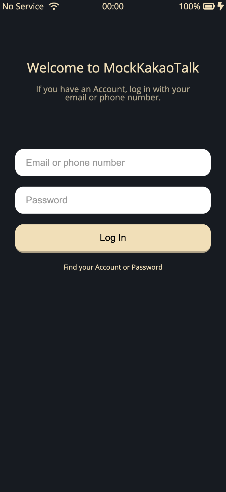
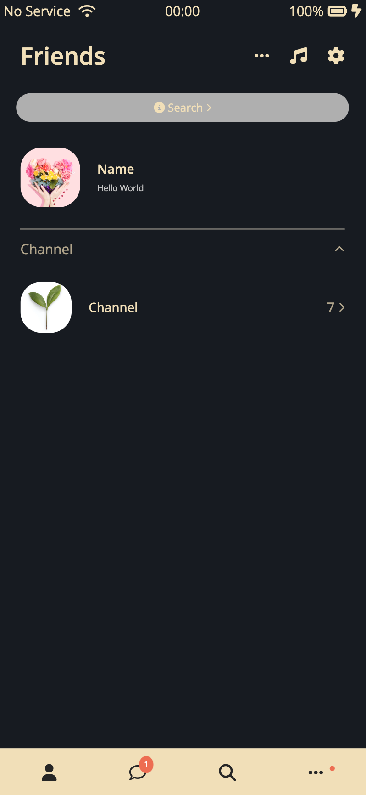
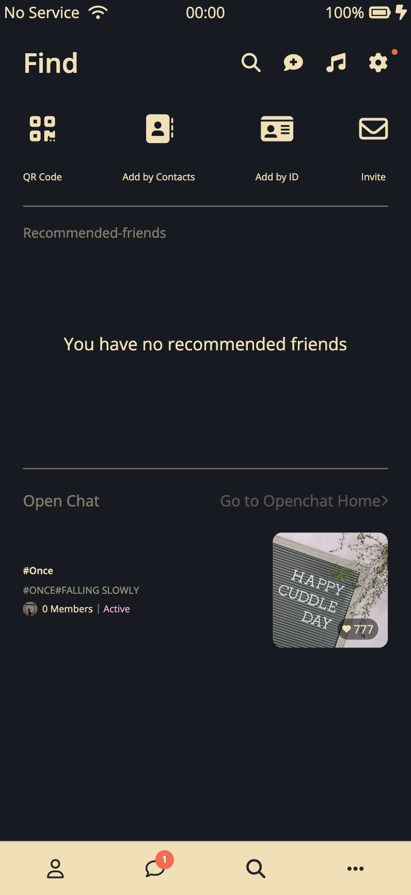
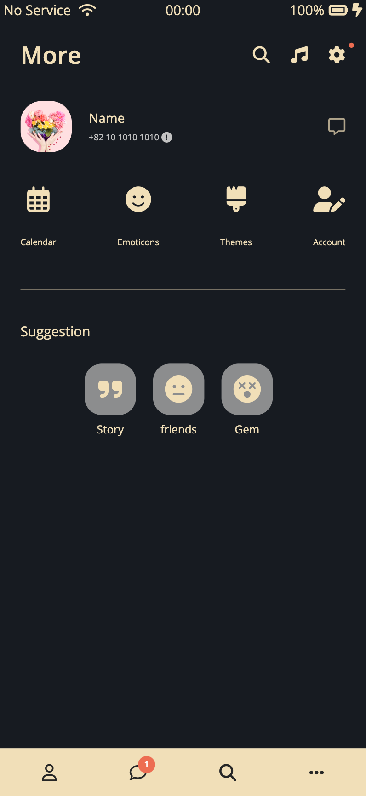
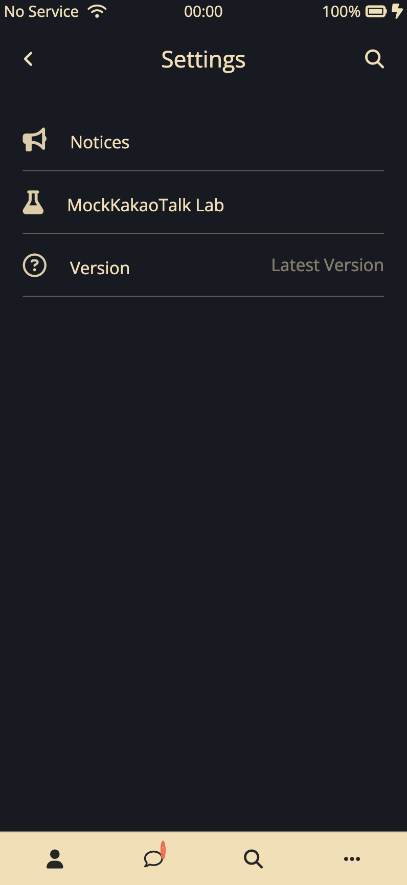

# SocialNetwork App

이 프로젝트는 카카오톡의 주요 기능을 모방하여 JavaScript로 만든 클론 애플리케이션입니다. 사용자 인터페이스부터 기능적인 상호작용까지 카카오톡의 경험을 최대한 재현하기 위해 노력했습니다.

## 주요 기능

- **로그인 시스템**: 카카오톡과 유사한 로그인 시스템으로, 이메일 또는 전화번호와 비밀번호를 통해 접속할 수 있습니다.

- **친구 목록**: 친구들을 목록으로 보여주며, 검색 및 관리 기능을 제공합니다.

- **메시지 기능**: 사용자 친화적인 채팅 인터페이스를 통해 메시지를 보내고 받을 수 있습니다.

- **친구 찾기 및 추가**: QR 코드, 연락처, ID 또는 초대 시스템을 통해 친구나 채팅 채널을 찾을 수 있습니다.

- **설정 및 커스터마이징**: 설정에 접속하여 알림 관리 및 계정 설정과 같은 경험을 커스터마이즈할 수 있습니다.

- **기타 기능들**: 달력, 이모티콘, 테마, 계정 관리 등 추가 기능들을 제공합니다.

## 주요 화면

