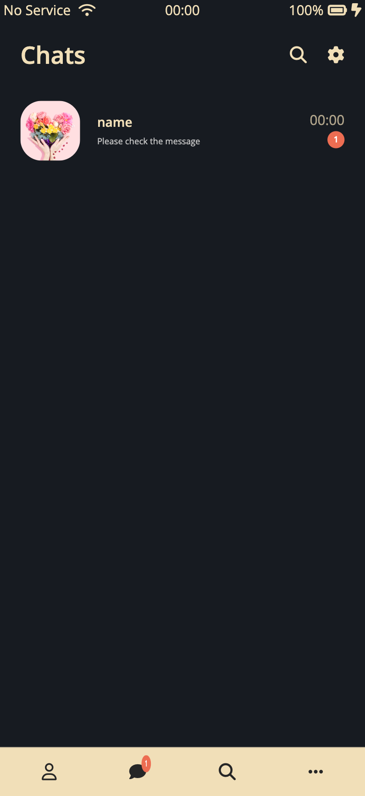

# KakaoTalk clone App

이 프로젝트는 카카오톡의 주요 기능을 모방하여 만든 클론 애플리케이션입니다. 사용자 인터페이스부터 기능적인 상호작용까지 카카오톡의 경험을 최대한 재현하기 위해 노력했습니다.

## 주요 기능 소개

- **앱 실행 시 애니메이션 적용**

- **로그인 화면 UI 구현**
  
- **친구 목록 탭 UI 구현**

- **메시지 탭 UI 구현**

- **채널 탭 UI 구현**

- **설정 탭 UI 구현**

## 주요 화면

